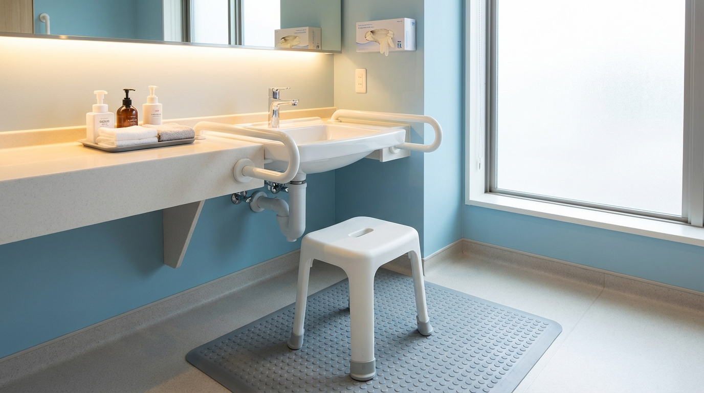
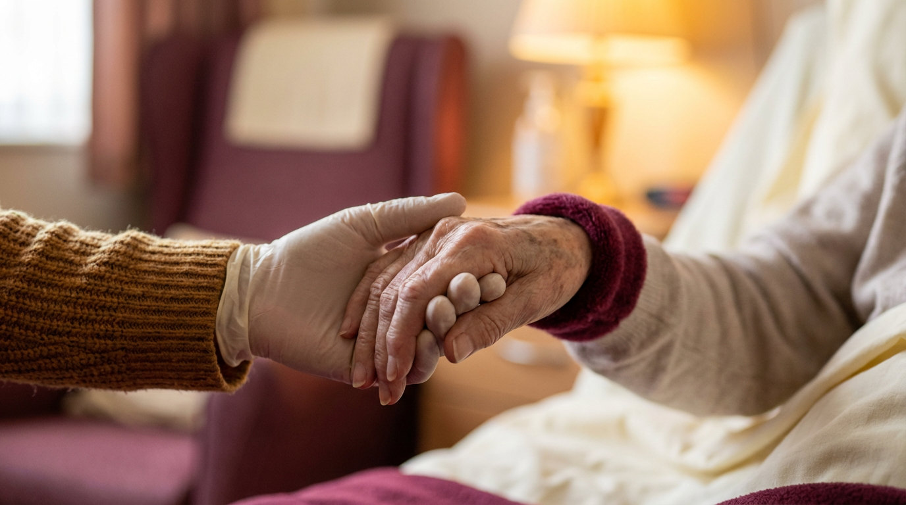

# Einführung in die Grundpflege
## Schulungshandbuch für Pflegehilfskräfte
### Caritas Maria-Hötte-Stift, Münster

---

### Vorwort

Willkommen im Caritas Maria-Hötte-Stift. Dieses Handbuch begleitet Ihre Fortbildung zur "Einführung in die Grundpflege". Unser Ziel ist es, Ihnen nicht nur die technischen Handgriffe zu vermitteln, sondern auch die Haltung, die unsere Arbeit prägt: Kompetenz, Empathie und Professionalität.

Die Grundpflege ist weit mehr als nur Waschen. Sie ist Beziehungsarbeit, Gesundheitsförderung und oft der intimste Moment im Alltag unserer Bewohner:innen.

> **Hinweis:** Diese Schulung ersetzt weder eine pflegerische Ausbildung noch eine Pflegefachkraft. Bei Unsicherheit gilt immer: Rückfrage an die examinierte Pflegekraft Ihres Wohnbereichs.

---

### Modul 1: Grundlagen, Rolle & Pflegeprozess

**Lernziele:** Nach diesem Modul können Sie Ihre Rolle einordnen, Grundpflege von Behandlungspflege unterscheiden, den 4-phasigen Pflegeprozess nach dem Strukturmodell (Beikirch) erklären, SIS / Maßnahmenplan / Berichteblatt voneinander abgrenzen, Schweigepflicht und Händehygiene anwenden und erkennen, wann eine Fachkraft hinzugezogen werden muss.

#### Ihre Rolle als Pflegehilfskraft

Bestimmte Tätigkeiten sind ausgebildeten Pflegefachkräften vorbehalten (Vorbehaltsaufgaben nach **§ 4 PflBG**). Andere Tätigkeiten dürfen Sie nach Anleitung und schriftlicher Delegation übernehmen.

| Typische Aufgaben | Nicht ohne Pflegefachkraft |
| --- | --- |
| Körperpflege (Waschen, Mund-, Haarpflege) | Pflegeplanung und -evaluation |
| Hilfe beim An- und Auskleiden | Erst-Anamnese, Pflegediagnose |
| Hilfe bei Nahrungs- und Flüssigkeitsaufnahme | Wundversorgung, Verbandwechsel |
| Lagern, Mobilisieren, Transfer (nach Anleitung) | Medikamentengabe (außer per Delegation) |
| Beobachten und weitergeben | Injektionen, Katheterisieren, Sondenkost |
| Begleitung, Zuwendung, Tagesstruktur | Behandlungspflege ohne Anordnung |

> **Goldene Regel:** Bei Unsicherheit nicht durchführen, sondern Pflegefachkraft fragen.

#### Grundpflege vs. Behandlungspflege

* **Grundpflege (SGB XI § 14/15):** Unterstützung in den Aktivitäten des täglichen Lebens. Pflegeversicherung. Hier sind Sie zentral.
* **Behandlungspflege (SGB V § 37):** Ärztlich verordnete Maßnahmen. Krankenkasse. Erfordert Delegation oder Pflegefachkraft.

#### Der Pflegeprozess nach dem Strukturmodell – vier Phasen

Wir arbeiten nach dem **Strukturmodell**. Es umfasst **vier Phasen**:

1. **Strukturierte Informationssammlung (SIS)** – initiale Erhebung und fortlaufende Aktualisierung aus Sicht der bewohnenden Person. Eingangsfrage: „Was bewegt Sie? Was brauchen Sie? Was können wir für Sie tun?". Sie liefern Beobachtungen aus dem Pflegealltag.
2. **Individueller Maßnahmenplan** – aus der SIS abgeleitete, individuell zugeschnittene Maßnahmen. Sie lesen den Plan und führen ihn aus; die Planung selbst ist Vorbehalt der Pflegefachkraft.
3. **Berichteblatt** – hier werden ausschließlich **Abweichungen** vom Maßnahmenplan, neue Beobachtungen und besondere Ereignisse dokumentiert. Nicht jede Routinetätigkeit.
4. **Evaluation** – anlassbezogen oder in Intervallen prüft die Pflegefachkraft anhand des Berichteblatts, ob der Plan angepasst werden muss.

#### SIS – sechs Themenfelder

Sechs Themenfelder, die ein Bild von der zu pflegenden Person mit ihren individuellen **Ressourcen**, **Unterstützungsbedarfen** und **Pflegerisiken** zeichnen. Die SIS ist gegliedert in:

* **A** Kognition und Kommunikation
* **B** Mobilität und Beweglichkeit
* **C** Krankheitsbezogene Anforderungen und Belastungen
* **D** Selbstversorgung *(Ihr Hauptarbeitsfeld)*
* **E** Leben in sozialen Beziehungen
* **F** Wohnen / Haushaltsführung (im Heim: Sicherheit und Orientierung im Wohnbereich)

#### Risikomatrix – fünf Pflegerisiken

Im Anschluss an die SIS prüft die Pflegefachkraft anhand der Risikomatrix:

* **Dekubitus** – Hautrötungen, Druckstellen, Lagerung, Mobilität
* **Sturz** – Schwindel, Gangbild, Hilfsmittel, Sehkraft
* **Inkontinenz** – Urin-/Stuhlausscheidung, Hautzustand
* **Schmerz** – verbal und nonverbal (Mimik, Stöhnen, Abwehr)
* **Ernährung** – Appetit, Trinkmenge, Schluckstörung, Gewicht

Ihre Beobachtungen sind dafür zentral.

#### Schweigepflicht & Datenschutz

Alles, was Sie über Bewohner:innen erfahren, unterliegt **§ 203 StGB** und der **DSGVO**. Keine Weitergabe an Außenstehende, keine Gespräche im Aufzug oder in sozialen Medien, keine Fotos ohne schriftliche Einwilligung.

#### Berichteblatt – nur Abweichungen, kurz und sachlich

Im Strukturmodell wird im Berichteblatt **nicht jede Routinetätigkeit** dokumentiert. Eingetragen werden ausschließlich:

* Abweichungen vom Maßnahmenplan (z. B. Bewohnerin lehnt Waschung ab)
* Neue Beobachtungen mit Bezug zu den fünf Pflegerisiken
* Auffälligkeiten in einem der SIS-Themenfelder
* Ereignisse, Stürze, Schmerzäußerungen, Stimmungsveränderungen
* Ergebnisse von Maßnahmen, wenn sie für die Evaluation relevant sind

**Aufbau jedes Eintrags:** Datum/Uhrzeit · Handzeichen · was beobachtet (Tatsachen, keine Vermutungen) · ggf. an wen weitergegeben.

*Beispiel:* „08:30 Uhr / KN – beim Waschen 2 cm große, nicht wegdrückbare Hautrötung am Steißbein. PFK Müller informiert, Lagerungsplan ergänzt."

#### Grundsätze der Körperpflege

Körperpflege dient nicht nur der Reinigung. Sie fördert das Wohlbefinden, unterstützt die Wahrnehmung des eigenen Körpers und stärkt das Selbstwertgefühl.

**Ziele der Körperpflege:** Reinigung und Pflege der Haut · Förderung von Wahrnehmung und Wohlbefinden (basale Stimulation) · Krankheitsbeobachtung · Erhalt der Selbstständigkeit (aktivierende Pflege).

**Grundsätze:**
*   **Ressourcen fördern:** Was kann die Person noch selbst? Erst beobachten, dann unterstützen.
*   **Intimsphäre wahren:** Nur so viel Körperfläche wie nötig aufdecken, Tür schließen.
*   **Händehygiene:** 5 Momente der WHO (siehe oben). Einmalhandschuhe nur bei Kontakt mit Körperflüssigkeiten, Schleimhäuten oder nicht-intakter Haut – nicht routinemäßig.
*   **Kommunikation:** Jeden Schritt ankündigen und erklären – auch bei Menschen mit Demenz oder reduzierter Bewusstseinslage.

---

### Modul 2: Ganzkörperwaschung im Bett

Diese Form der Waschung ist anspruchsvoll und kommt zum Einsatz, wenn die Bewohnerin/der Bewohner das Bett nicht verlassen kann.

**Vorbereitung:**
*   Material vollständig bereitlegen (Waschschüssel, **getrennte Waschlappen für Gesicht / Körper / Intimbereich**, Handtücher, Waschlotion, ggf. Hautcreme, frische Kleidung und Bettwäsche).
*   Raumtemperatur ca. 22–24 °C, Fenster und Türen schließen (Zugluft vermeiden, Auskühlung).
*   **Wassertemperatur ca. 37–43 °C** – immer mit der Innenseite des eigenen Unterarms prüfen. Bei Bewohner:innen mit Polyneuropathie (z. B. Diabetes), Demenz oder Sensibilitätsstörung darf die Temperaturkontrolle nie allein dem Bewohner überlassen werden (Verbrühungsgefahr!).
*   Bewohner:in informieren, Bett auf ergonomische Arbeitshöhe bringen (Eigenschutz Rücken).
*   Hygienische Händedesinfektion.

**Ablauf (Schritt für Schritt):**
1.  **Gesicht, Augen & Hals:** Nur klares, lauwarmes Wasser. Augen **vom inneren Augenwinkel (nasal) nach außen (temporal)** abwischen, dabei für jedes Auge eine **frische Stelle des Waschlappens** verwenden – so wird keine Keimverschleppung in den Tränen-Nasen-Gang verursacht.
2.  **Oberkörper & Arme:** Belebende Waschung **herzwärts** (von der Hand zur Schulter) zur Förderung der Wahrnehmung. Sorgfältig abtrocknen, besonders **Hautfalten unter der Brust und in den Achseln** (Intertrigo-Gefahr).
3.  **Rücken:** Bewohner:in zur Seite drehen. Rücken waschen, abtrocknen und **Hautinspektion**: Druckstellen am Steißbein, Schulterblatt, Ellenbogen, Ferse (Dekubitus-Prophylaxe). Fingertest: Lässt sich die Rötung wegdrücken? Wenn nein → an Fachkraft melden.
4.  **Beine & Füße:** Beine herzwärts waschen. **Zehenzwischenräume sehr gründlich trocknen** (Pilzgefahr), **keine Watte zwischen die Zehen legen** (Mazeration). Fersen und Knöchel auf Druckstellen prüfen.
5.  **Vorbereitung Intimpflege:** **Wasser wechseln**, frischer Waschlappen, frische Einmalhandschuhe. Intimsphäre durch Abdecken wahren.
6.  **Intimpflege Frau:** Beine anstellen. Erst die äußeren Schamlippen, dann mit gespreizten Schamlippen die kleinen Schamlippen reinigen, **immer von der Symphyse (vorne) zum Anus (hinten)** – mit jeder Wischbewegung eine frische Stelle des Waschlappens. So wird die Verschleppung von Darmkeimen in die Harnröhre vermieden (Prophylaxe Harnwegsinfekt).
7.  **Intimpflege Mann:** Vorhaut **vorsichtig** zurückschieben (bei Phimose nicht erzwingen!), Eichel reinigen, gut abtrocknen, **Vorhaut anschließend zwingend wieder vorschieben**.
    > ⚠ **WARNUNG:** Eine vergessene oder nicht zurückgeschobene Vorhaut kann zur **Paraphimose** ("spanischer Kragen") führen – das ist ein urologischer Notfall. Sofort Pflegefachkraft informieren.
8.  **Abschluss:** Frische Kleidung anziehen, faltenfreie Bettwäsche, bequeme Lagerung. Material ordnungsgemäß entsorgen, Hände desinfizieren, **Beobachtungen dokumentieren** (Hautveränderungen, Schmerzäußerungen, Stuhl-/Urinausscheidung, Allgemeinzustand) und an die zuständige Pflegefachkraft weitergeben.

---

### Modul 3: Waschung am Waschbecken

Wenn die Mobilität es zulässt, ist dies der ideale Weg zur Förderung der Selbstständigkeit. **Die Belastbarkeit muss tagesaktuell beurteilt werden** – ein Bewohner, der gestern aufstehen konnte, kann heute zu schwach sein.

**Sicherheit:**
*   Rutschfeste Matten, festes Schuhwerk, **keine Handtücher auf dem Boden** (Stolperfalle).
*   Stabile Sitzgelegenheit (Duschhocker/Stuhl mit Lehne).
*   Notrufknopf und Haltegriffe in Reichweite.
*   Wassertemperatur **immer durch die Pflegekraft mit dem eigenen Unterarm geprüft**, anschließend ggf. den Bewohner prüfen lassen (Verbrühungsschutz).
*   Eigenschutz der Pflegekraft: rückenschonendes Arbeiten, Knie beugen, nicht aus dem Rücken heben.

**Ablauf:**
*   Bewohner:in wäscht Gesicht, Arme und Oberkörper so weit wie möglich selbst.
*   Pflegekraft unterstützt bei Rücken, Füßen und schwer erreichbaren Stellen.
*   Intimpflege unter Anleitung – wenn möglich selbstständig durch den Bewohner. Pflegekraft achtet auf vollständige Reinigung und Trocknung.
*   Auskühlung vermeiden: zügig abtrocknen, Bademantel oder Handtuch um die Schultern.

---

### Modul 4: Anleitung & Aktivierung

"Hilfe zur Selbsthilfe" ist unser Leitbild – orientiert an den Konzepten der **aktivierenden Pflege**, der **Kinästhetik** und der **personenzentrierten Pflege nach Tom Kitwood**.

**Die 3 Säulen der Aktivierung:**
1.  **Ressourcen erkennen:** Nicht vorschnell handeln. Erst beobachten – Was kann die Person noch selbst, auch wenn es länger dauert?
2.  **Kommunikation:** Motivieren, loben, anleiten. Bei Menschen mit Demenz: kurze, klare Sätze, Augenkontakt, validierender Umgang (nach Naomi Feil).
3.  **Geduld:** Selbstständigkeit braucht Zeit. Geben Sie diese Zeit – auch wenn der Dienstplan drückt.

**Praxis-Tipp ("Führen statt Übernehmen"):**
Führen Sie die Hand der Bewohnerin/des Bewohners zum Waschlappen oder zur Zahnbürste, aber lassen Sie die eigentliche Bewegung von der Person selbst ausführen. Dieses Prinzip stammt aus der Kinästhetik und erhält die motorischen und kognitiven Fähigkeiten am wirksamsten.

---

### Anhang: Was muss ich sofort melden?

Bestimmte Beobachtungen müssen Sie **unverzüglich an die zuständige Pflegefachkraft** weitergeben – nicht erst am Schichtende:

*   Plötzliche Verwirrtheit, einseitige Lähmung, hängender Mundwinkel, Sprachstörung (**FAST: Face / Arms / Speech / Time** – Schlaganfallverdacht)
*   Atemnot, blaue Lippen, Brustschmerzen
*   Sturz – auch wenn die Person scheinbar unverletzt ist
*   Neue Druckstelle (nicht-wegdrückbare Rötung) oder offene Wunde
*   Ungewöhnlich hoher/niedriger Blutzuckerwert, Zittern, kalter Schweiß, Bewusstseinstrübung
*   Schmerzäußerungen, die neu oder ungewöhnlich stark sind
*   Verweigerung von Essen/Trinken über mehrere Mahlzeiten
*   Auffällige Veränderungen von Urin (Blut, dunkel, sehr wenig) oder Stuhl (schwarz, blutig, anhaltender Durchfall)

---

**Caritas Maria-Hötte-Stift – Fortbildung Grundpflege**
*Für interne Schulungszwecke. Die Inhalte orientieren sich an den Expertenstandards des DNQP, an den KRINKO-/RKI-Empfehlungen sowie an gängiger Pflegefachliteratur.*
